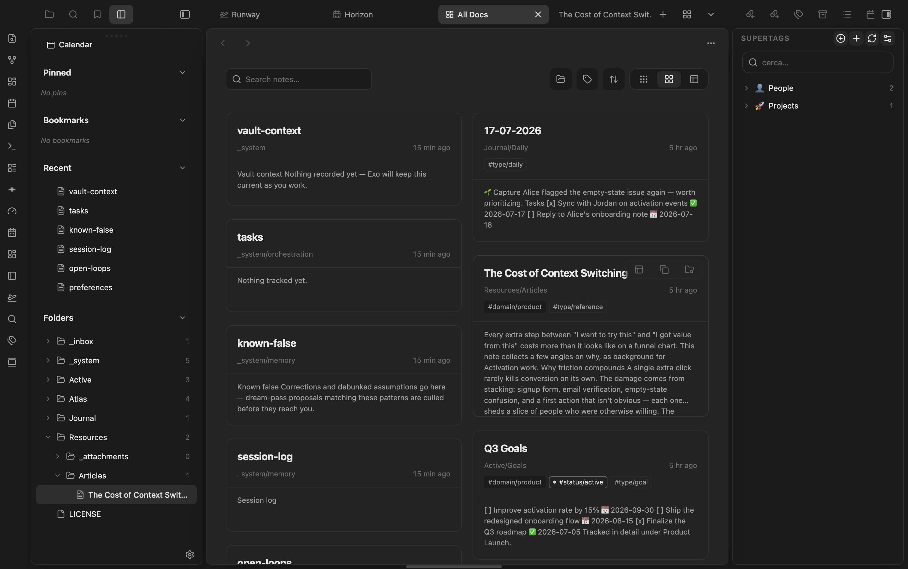
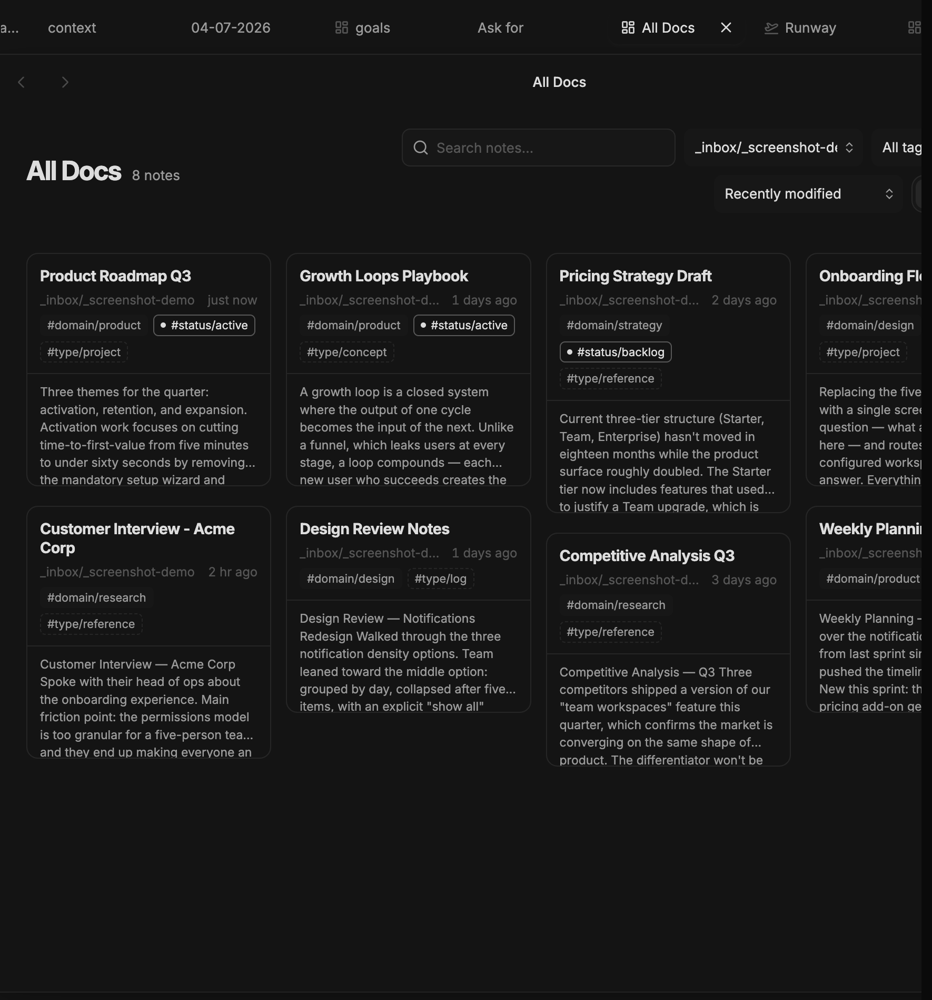

# Masonry

Masonry is a visual browser for Obsidian notes. It adds two native surfaces while keeping Markdown files and Bases as the source of truth:

- **All Docs**: a workspace tab for browsing the complete vault as a responsive document wall.
- **Masonry for Bases**: a custom Base view that renders filtered, sorted, and grouped results without replacing the native Base toolbar.

Selecting a card opens the note in Obsidian's editor. Modifier-click and middle-click open it in a new tab.

Part of the marioverse Obsidian plugin suite.

## Screenshots

| Editorial | Compact | Visual |
|---|---|---|
|  |  |  |

## Features

- Three presentation modes: **Compact**, **Editorial**, and **Visual** — compact and editorial show a preview excerpt too.
- Search, folder (including subfolders) and tag filters, six sort orders (persisted across sessions), lazy previews, and progressive loading in All Docs.
- Compact icon-button filters and sort open a themed, searchable picker (same style as the Quick Switcher) instead of the OS-native dropdown.
- Exclude folders (e.g. archives, templates) from All Docs via **Settings → Masonry → Excluded folders**.
- Native Base filtering, sorting, grouping, and configurable view properties.
- Local cover images from `cover`, `image`, or `thumbnail` frontmatter and image embeds.
- Card actions for opening a new tab, copying a wikilink, and revealing the note in the file explorer.
- Native Obsidian hover previews and keyboard navigation.

## Installation

### BRAT

1. Install and enable the [BRAT plugin](https://github.com/TfTHacker/obsidian42-brat).
2. In **Settings → BRAT**, choose **Add beta plugin**.
3. Enter `mariomile/obsidian-masonry` and enable Masonry.

### Manual

1. Download `main.js`, `manifest.json`, and `styles.css` from the latest GitHub release.
2. Create `<vault>/.obsidian/plugins/masonry/`.
3. Copy the three files into that directory.
4. Reload Obsidian and enable **Masonry** under **Community plugins**.

Masonry requires Obsidian 1.12.7 or newer.

## Covers and remote images

Masonry resolves the first available cover in this order:

1. `cover` frontmatter property
2. `image` frontmatter property
3. `thumbnail` frontmatter property
4. first local image embed
5. first external Markdown image

Frontmatter may contain a vault path, wikilink, Markdown image, or HTTP(S) URL. Local images work by default. Remote HTTP(S) images are disabled by default because loading them contacts the external host and can expose your IP address and request metadata. Enable **Settings → Masonry → Load remote images** only if you accept that behavior. Changing the setting clears cached previews and refreshes open Masonry views.

## Privacy

Masonry works locally in your vault. It does not require an account, collect telemetry, upload notes, or send note content to a Masonry service. The plugin makes no network requests unless you explicitly enable remote images; those image requests go directly to the hosts referenced by your notes.

## Configuration

Global defaults are available under **Settings → Community plugins → Masonry**. Each Masonry Base view can configure its presentation, preview length, folder visibility, and tag visibility through native Base view properties.

## Mobile

**Verified** — `isDesktopOnly: false` in `manifest.json`; `styles.css` ships a `pointer: coarse` media query extending small control hit areas to 44pt Apple HIG.

## Development

```sh
pnpm install
pnpm lint
pnpm typecheck
pnpm test
pnpm build
```

To test a local build in Obsidian:

```sh
obsidian plugin:reload id=masonry
```

Manual validation should cover All Docs persistence, native Base chrome, all presentation modes, keyboard opening, card actions, narrow-container layout, remote-image opt-in, and the complete hover ring on a first-row card.

## Try it

See it running in the [Obsidianverse sample vault](https://github.com/mariomile/obsidianverse-sample-vault), a small, fictional vault with the whole plugin suite pre-configured.

## License

[MIT](LICENSE)
